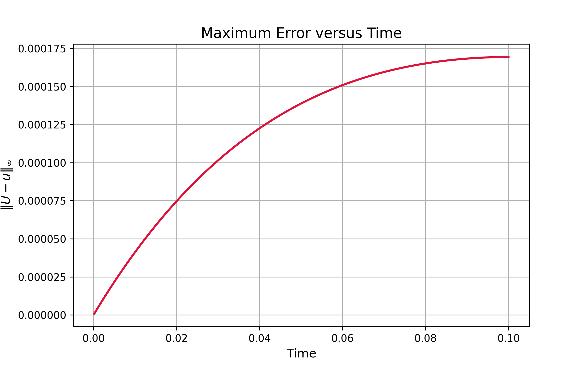
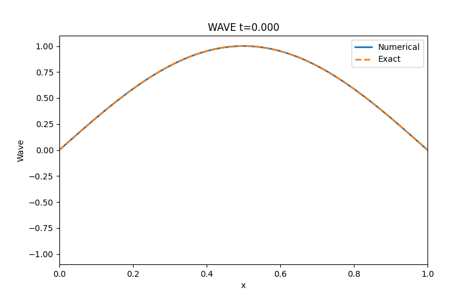
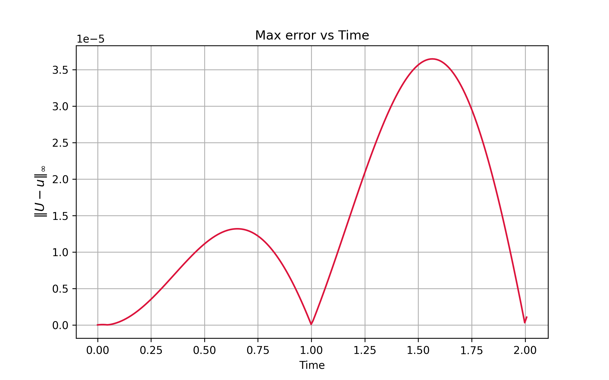
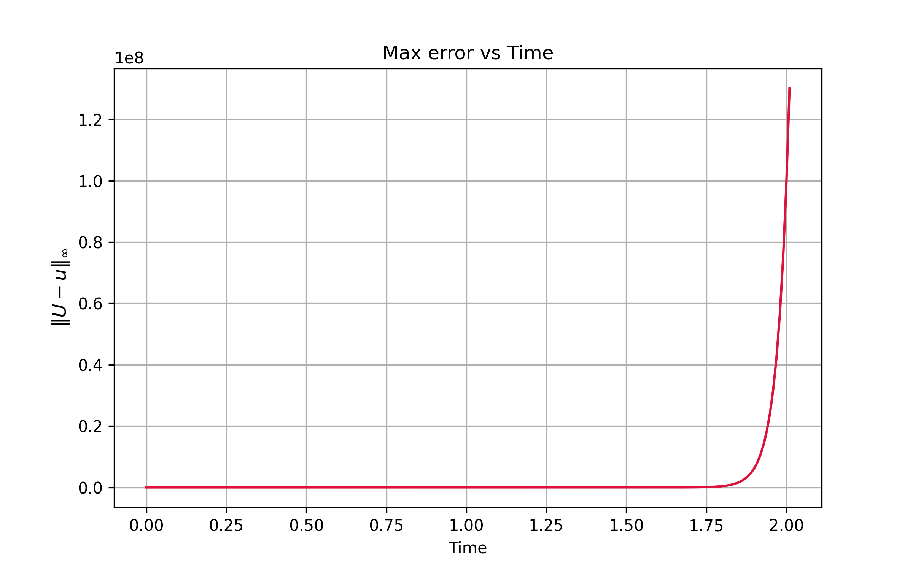
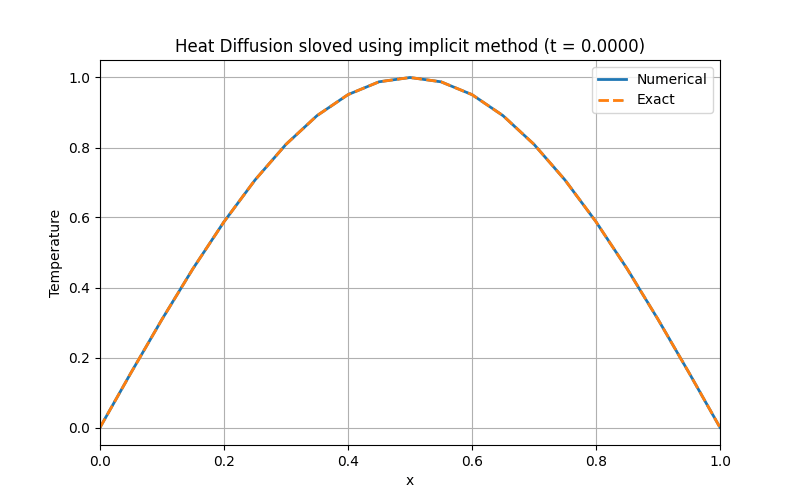

# Numeric_PDE_illustration
Illustration of numeric methods used to solve one dimensional heat equation and wave equation, their evolution of error over time. 

## Diffusion equation

To solve

$$
u_t = a u_{xx}
$$

$$
0 < x < 1
$$

Given

$$
u(0,t) = u(1,t) = 0,
$$

$$
u(x,0) = \sin(\pi x)
$$

using forward difference in time and central difference for space.

primary code used to apply this is the following

```python
a = 1.0
L = 1.0  # length of space domain
T = 0.1  # Final time

# Step sizes
Nx = 50
dx = L / 50
dt = 0.8 * dx**2 / (2 * a)  # the method is conditionally stable, hence the specific choice for dt
Nt = int(T / dt)

x = np.linspace(0, L, Nx + 1)

r = a * dt / dx**2

# Initial condition
u = np.sin(np.pi * x)

# Boundary condition
u[0] = 0.0
u[-1] = 0.0

for n in range(Nt):
    for i in range(1,Nx):
        u_new[i] =u[i] + r*(u[i-1] - 2*u[i] + u[i+1]) #marching forward in time by applying the scheme
    u[0] = 0.0
    u[-1] = 0.0 # forcing boundry condition

    u[:] = u_new # updating new soltuion
```
The following are the results and evolution of error overtime




## Conditional Stability of the FTCS Scheme

The Forward-Time Central-Space (FTCS) method for the one-dimensional heat equation is conditionally stable. The stability of the numerical solution depends on the choice of the time step relative to the spatial discretization.

For the heat equation,stability analysis shows that the FTCS scheme is stable only when,


$$
r=\frac{a\Delta t}{\Delta x^2} \le\frac{1}{2} 
$$

the step sizes of the following animation does not follow this condition


# Wave Equation

We consider the one-dimensional wave equation

$$
u_{tt}=c^2u_{xx},
$$


$$
0\le x\le L,
$$

with

$$
u(0,t)=u(L,t)=0,
$$


$$
u(x,0)=\sin(\pi x),
$$

and

$$
u_t(x,0)=0.
$$

For these initial and boundary conditions, the analytical solution is

$$
u(x,t)=\cos(c\pi t)\sin(\pi x),
$$


## Finite Difference Scheme


The second-order central difference approximation is used in both space and time. 

$$
\frac{U_i^{\,n+1}-2U_i^{\,n}+U_i^{\,n-1}}{\Delta t^2}
=
c^2
\frac{U_{i+1}^{\,n}-2U_i^{\,n}+U_{i-1}^{\,n}}
{\Delta x^2}
$$

Rearranging yields the explicit update formula

$$
U_i^{\,n+1}
=
2U_i^{\,n}
-
U_i^{\,n-1}
+
r^2
\left(
U_{i+1}^{\,n}
-
2U_i^{\,n}
+
U_{i-1}^{\,n}
\right)
$$

where

$$
r
=
\frac{c\Delta t}{\Delta x}
$$


## Stability Condition

The explicit finite difference method for the wave equation is conditionally stable. Stability is guaranteed only if

$$
r \le 1.
$$

primary code:
```python
    dx = L / Nx
    x = np.linspace(0,L,Nx+1)
    dt = r*dx / c
    Nt=int(T/dt)

    #intial condition
    u = np.sin(np.pi*x)
    u_1 = u - (0.5*pow(dt,2)*pow(c*np.pi,2)*np.sin(np.pi*x)) # an approximation of "1st" step from velocity codition(scheme needs past 2 time steps)
    #boundary condition
    u[0] = 0.0
    u[-1] = 0.0
    u_1[0] = 0.0
    u_1[-1] = 0.0

    #time stepping
    u_new = np.zeros_like(u)

     for n in range(Nt):
        for i in range(1,Nx):
            u_new[i] = 2*u_1[i] - u[i] + pow(r,2)*(u_1[i+1]-2*u_1[i]+u_1[i-1])
        #imposing boundary condition
        u_new[0] = 0
        u_new[-1] = 0
            
        u[:] = u_1
        u_1[:] = u_new
```
Results:



## Conditional Satablity Illustration

as previously metionedThe explicit finite difference method for the wave equation is conditionally stable. Stability is guaranteed only if

$$
r \le 1.
$$

the following uses $r \ge 1$




# Implicit Method for the Heat Equation (Backward Euler)

We consider the one-dimensional heat equation

$$
u_t=a\,u_{xx},
$$

on 

$$
0\le x\le L
$$

with
$$
u(0,t)=u(L,t)=0
$$


$$
u(x,0)=\sin(\pi x)
$$

For these initial and boundary conditions, the analytical solution is

$$
u(x,t)=e^{-a\pi^2t}\sin(\pi x)
$$

which is used to validate the numerical approximation and compute the error throughout the simulation.


## Backward Euler Finite Difference Scheme

Replacing the derivatives with finite difference approximations gives

$$
\frac{U_i^{\,n+1}-U_i^{\,n}}{\Delta t}
=
a
\frac{
U_{i+1}^{\,n+1}
-
2U_i^{\,n+1}
+
U_{i-1}^{\,n+1}
}
{\Delta x^2}
$$

the mesh ratio

$$
r=\frac{a\Delta t}{\Delta x^2}
$$

the finite difference scheme can be written as

$$
-rU_{i-1}^{\,n+1}
+
(1+2r)U_i^{\,n+1}
-rU_{i+1}^{\,n+1}
=
U_i^{\,n}
$$

Since the unknown values at the new time level appear on both sides of the stencil, the numerical solution cannot be updated point-by-point. Instead, the values at each time step are obtained simultaneously by solving a system of linear equations.


## Matrix Form

For all interior grid points, the finite difference equations can be written compactly as

$$
A\,U^{\,n+1}=U^{\,n}
$$

where

$$
A=
\begin{bmatrix}
1+2r & -r & 0 & \cdots & 0\\
-r & 1+2r & -r & \ddots & \vdots\\
0 & -r & 1+2r & \ddots & 0\\
\vdots & \ddots & \ddots & \ddots & -r\\
0 & \cdots & 0 & -r & 1+2r
\end{bmatrix}
$$

At every time step, this tridiagonal matrix is solved to obtain the temperature distribution at the next time level.


## Stability

An advantage of the Backward Euler method is that it is unconditionally stable. Unlike the explicit FTCS scheme
$$
r=\frac{a\Delta t}{\Delta x^2}
$$

Although choosing a very large time step may reduce the accuracy of the numerical solution, the method remains stable and does not exhibit the numerical blow-up observed in explicit schemes. 

code:
```python
    r = a * dt/pow(dx,2)  #with the default values r = 0.5
    Nx = int(L/dx)
    N = Nx-1 #number of unknown space points
    Nt = int(T/dt)
    x = np.linspace(0,L,Nx+1)

    #intial and boundary conditions
    u = np.sin(np.pi * x)
    u[0] = 0.0
    u[-1] = 0.0
    
    #Handling the matrix A
    A = np.zeros((N, N))
    #filling dialgonals
    for i in range(N):
        A[i,i] = 1 + 2*r
    #filling left diagonals
    for i in range(1,N):
        A[i,i-1] = -r
    #filling left diagonals
    for i in range(N-1):
        A[i,i+1] = -r

 
    #time loop 
    u_new = np.zeros_like(u)  
    for n in range(Nt):
        interior = np.linalg.solve(A,u[1:-1])
        u_new = u.copy() #since boundry condition is zero, we solve for interior points
        u_new[1:-1] = interior
        u[:] = u_new
```
results:


## Unconditional stability and accuracy

The following block uses a very big value for r. We can observe that the solution is still stable but is inaccurate.(The .gif is fast but towards the end we can see that the ture solution and numeric solution do not overlap much).



